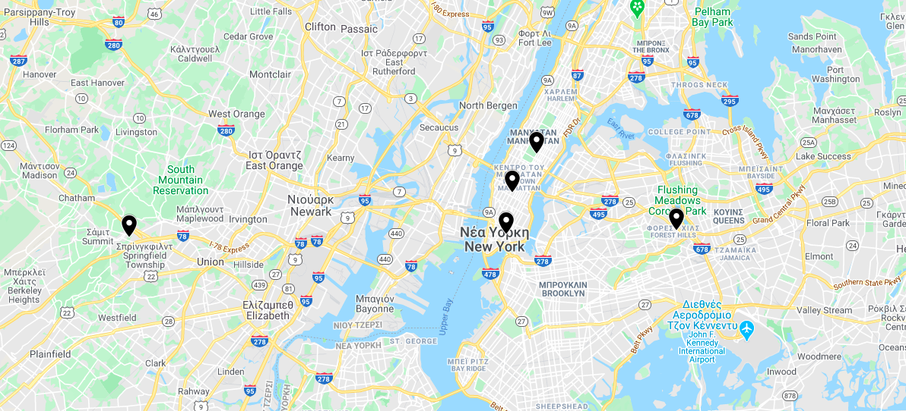

# Clustering of Taxi Trip Data using Spark


## Dataset

The dataset is the [2015 Yellow Taxi Trip Data](https://data.cityofnewyork.us/Transportation/2015-Yellow-Taxi-Trip-Data/ba8s-jw6u). It includes trip records from all trips completed in yellow taxis from in NYC from January to June in 2015. Due to limited resources, we used only a 2 GB subset of the dataset. This subset contains 13m trip records and are available [here](http://www.cslab.ntua.gr/courses/atds/yellow_trip_data.zip). In this file, two comma-delimited text files (.csv) are available. The first contains all the necessary information about a route and the second contains information about the taxi vendors.


## Algorithm

The scope of the project is to find the coordinates of the top 5 pickup locations. In order to achieve this, we implemented the [K-means](https://en.wikipedia.org/wiki/K-means_clustering) with k=5, that clusters the pickup locations in five regions.


## Requirements

- numpy
- simplekml


## Usage

We assume that Spark and HDFS are already installed in our system.

- Upload data in hdfs

```
hadoop fs -put ./yellow_tripdata_1m.csv hdfs://master:9000/yellow_tripdata_1m.csv
```

- Install necessary requirements

```
pip install -r requirements.txt
```

- Submit the job in a Spark environment

```
spark-submit kmeans.py
```

- Get the results from the hdfs and print them

```
hadoop fs -getmerge hdfs://master:9000/kmeans.res ./kmeans.res
cat kmeans.res 

[-74.33685886  40.71401562]
[-73.84222159  40.71854692]
[-73.99625567  40.71627292]
[-73.99097947  40.74444285]
[-73.96875398  40.77099479]
```

- Convert them in kml form

```
python create_kml.py 
```


## Results

 <p float="left">
  
</p>


## Project Structure

- ```kmeans.py:``` Runs the kmeans algorithm using Spark Map Reduce jobs.
- ```create_kml.py:``` Creates a kml file from the output.
- ```kmeans.res:``` Coordinates of the final centers.
- ```report.pdf:``` Report of the project in Greek
- ```description.pdf:``` Project description in Greek

